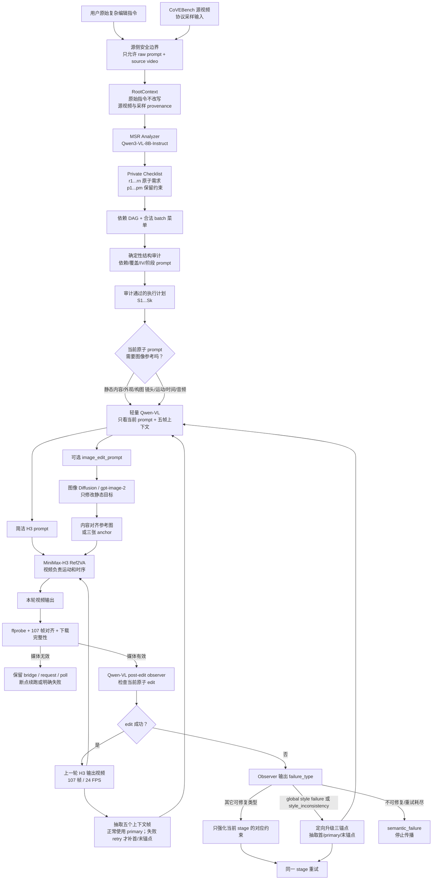
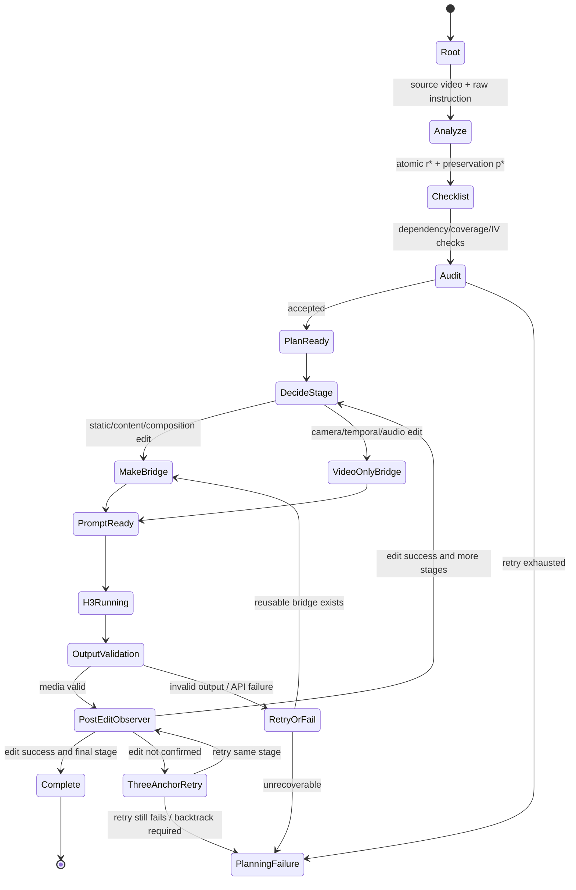

# 从 MSR 控制器到 MiniMax-H3 多步参考编辑：完整 Agent 流程

> 组会讲解版。本文把 Aurora-MSR 控制层、CoVEBench 输入边界、MiniMax-H3 多步执行器、每步的 Qwen-VL prompt 优化器，以及图像 Diffusion/图像编辑参考桥接统一整理起来。
>
> 重要边界：MSR 控制器是“决定下一步做什么”的控制平面；MiniMax-H3 是“实际生成视频”的执行模型；Qwen-VL 是“检查/改写当前一步 prompt”的辅助模型；图像模型只负责生成静态外观参考，不负责生成视频。它们不是同一个 Agent，也不是把完整结构化计划原样塞给 H3。

---

## 1. 一句话概括

整个系统可以概括为：

> **原始复杂编辑指令 → MSR 控制器拆成可验证的原子需求和依赖图 → 审计/确定性编译为多步执行计划 → 每一步先判断是否需要静态参考图 → Qwen-VL 只看当前原子 prompt 和 parent/output 的五个上下文帧，生成简洁 H3 prompt 以及可选的图像编辑 prompt → 图像模型制作内容对齐的参考帧 → MiniMax-H3 用“上一轮视频负责运动、参考图负责静态外观”的方式生成下一轮视频 → 本轮结束后 Qwen-VL 检查当前 edit 并给出 failure_type → 按失败类型定向修复，全局风格失败或风格时序不一致才升级三锚点 → 语义失败停止传播。**

核心思想是把不同模型的职责拆开：

| 模块 | 解决的问题 | 不负责的事情 |
| --- | --- | --- |
| MSR Controller | 长指令如何拆解、依赖如何排序、失败后从哪一个状态继续 | 不直接生成视频 |
| Qwen-VL Analyzer | 将原始请求拆成原子编辑项和视觉检查问题 | 不编写任意 H3 prompt，不决定 benchmark 结果 |
| Qwen-VL Generator / Planner | 在控制器给出的合法 batch 中选择下一步 | 不自由生成 requirement ID，不添加未选编辑 |
| Prompt Refiner / Success Gate | 生成当前一条原子编辑的短 prompt，并在输出后检查该 edit 是否出现 | 不重写完整任务，不把结构化 wrapper 传给 H3 |
| 图像 Diffusion / 图像编辑模型 | 根据当前关键帧和当前静态目标，生成内容对齐的外观参考 | 不负责运动、时间、音频和整段视频 |
| MiniMax-H3 Ref2VA | 根据视频和文本/图像条件生成 107 帧视频 | 不提供严格的逐对象 mask 保证 |
| Evaluator / Validator | 检查输出是否可解码、帧数/FPS 是否正确、阶段是否成功 | 不把“能解码”当成语义完成 |

---

## 2. 总体架构



### 2.1 两个层次必须分开讲

**控制层（MSR）**回答：

- 这条长指令包含哪些独立编辑要求？
- 哪些要求必须先于其他要求？
- 当前状态还缺哪些要求？
- 当前分支不稳定时，应该继续、回溯还是选择之前的最佳状态？

**执行层（H3 + reference bridge）**回答：

- 当前这一轮到底只让 H3 做哪一个原子编辑？
- 这一轮需要图片参考，还是视频自身已经足够？
- 图片参考应该从上一轮哪个时间点抽取？
- H3 的 prompt 如何明确区分 `<Video 1>` 与 `<Picture 1>` 的职责？

MSR 可以在没有 GPU 的情况下测试；H3 执行需要本地 ComfyUI/INT8 权重或线上 MiniMax-H3 API；两者之间通过**审计后的阶段计划和父视频路径**连接。

---

## 3. 输入边界与数据契约

### 3.1 RootContext：整个运行的不可变根

每个任务首先形成一个 `RootContext`，包含：

- 原始 `raw_instruction`，只读，不能被“优化 prompt”覆盖；
- 原始 source video 和给模型的 protocol-sampled video；
- 任务 ID、帧采样、尺寸、FPS 等 provenance；
- 不包含 target video description、官方答案、evaluation group、官方 metric。

根视频永远保留，用于最终 source-relative preservation 检查。后续状态只能引用“父状态输出”作为下一轮输入，不能悄悄跳回另一个中间文件。

### 3.2 CoVEBench 信息隔离

控制器和执行 Agent 允许读取：

```text
task_id
source_video / sampled_video
raw editing_instruction
当前候选视频和生成元数据
从源指令推导出的 private checklist
```

明确禁止进入 Planner、Actor、Evaluator 或 Prompt Refiner 的字段：

```text
target_video_description
evaluation_groups
official_answers
official_metrics
target labels / category hierarchy
planner raw response（不应被下游模型当作事实）
```

这不是形式上的限制，而是为了保证生成计划和视频时没有“看答案”。

### 3.3 统一视频格式

当前 MiniMax-H3 实验将每个输入和输出固定为：

| 项目 | 固定值 |
| --- | --- |
| 画布 | `1344 x 768`（768P、16:9） |
| 帧数 | `107` |
| FPS | `24` |
| 时长 | 约 `4.459 s` |
| 采样 | 覆盖源视频时长的均匀 107 帧，再设置为 24 FPS |
| H3 local steps | `20` |
| seed | `42` |
| video/audio shift | `12 / 3` |

每一次 H3 输出先经过 `ffprobe` 验证，失败的输出不能作为下一轮的输入。线上 API 可能返回无音频视频，因此会在进入下一轮前补充 silent AAC track，但不会改变视频帧序列。

---

## 4. MSR 控制器：从长指令到可验证状态树

### 4.1 Analyzer：一次拆解，形成 Private Checklist

本地 adapter-free `Qwen3-VL-8B-Instruct` 作为 MSR Instruction Analyzer。它只看原始源视频和原始编辑指令，输出两类记录：

1. **可执行原子需求 `r1, r2, ...`**
   - 每项只表达一个视觉动作；
   - 带一个视觉 Yes/No 检查问题；
   - 可以依赖更早的 `r*`；
   - 目标对象的位置、可见性、时间条件通常保留在同一个原子项里。
2. **保留约束 `p1, p2, ...`**
   - 例如“其它未修改内容保持不变”；
   - 进入 prompt 编译和评估；
   - 不能被当成独立编辑动作，也不消耗 Instruction Volume。

Analyzer 不输出 source description，因为“源视频里有什么”不是一个可调度的编辑要求；也不允许把完整用户请求复制到一个大 item 中。

### 4.2 依赖 DAG 和 Instruction Volume

控制器给每个原子需求分配稳定的 `r*` ID，并根据原子项的依赖建立 DAG：

```text
r2  核心动作/对象建立
├── r3  依赖 r2 的接触或姿态约束
├── r4  依赖 r2 的构图约束
└── r5  依赖 r2 的镜头强调

r1  全局风格（可以和 r2 并列，但执行上可后置）
p1  全局保留约束（约束，不是编辑）
```

`Instruction Volume (IV)` 限制每轮最多选择多少个原子需求。控制器先枚举所有依赖合法、未完成、大小不超过 IV 的 batch：

```text
b1 = {r1}
b2 = {r2, r3}
b3 = {r2}
...
```

Generator 只能从这个菜单中选择 `selected_batch_id`，不能自己返回任意 ID 列表、自由 reasoning 或完整 Actor prompt。这样可以把“模型决定做什么”和“控制器决定允许做什么”分离。

### 4.3 确定性 prompt 编译

选中 batch 后，控制器重新验证：

- ID 是否存在、是否重复；
- 依赖是否已经满足；
- 是否超过 IV；
- 是否已经完成或在同一父状态重复尝试；
- 生成的 instruction 是否严格等于 `compile_instruction(selected_ids)` 的确定性结果。

只有通过验证的 prompt 才交给 Actor/H3。`p*` 保留约束可以作为连续性约束加入编译逻辑，但不能“伪装”成一个额外的编辑。

### 4.4 Tree-of-States、Graph-of-References、Scheduler

每次成功的 Actor/H3 生成都会产生一个不可变 `EditState`：

```text
state_id
parent_state_id
depth
input_artifact = parent.output_artifact
output_artifact
thought / selected requirements
evaluation
reference_state_ids
scheduler_event
```

控制器维护两种拓扑：

- **Tree-of-States (ToS)**：每个候选状态只有一个父状态；用于真正的编辑链、分支、回溯。
- **Graph-of-References (GoR)**：在相邻深度窗口中找视觉相似的历史状态，给下一次 Generator 提供摘要参考；GoR 只影响文本决策，不把历史视频自动塞成 H3 的视觉参考图。

默认调度顺序：

1. 用 `(instruction_following, preservation, quality, shallower_depth)` 对已有状态排序，更新 temporary best；
2. 若达到步数预算，终止；
3. 若 best 达到完成阈值且深度足够，终止；
4. 当前状态满足 stay threshold、深度、质量下降容忍度和 child capacity，则继续扩展；
5. 否则回溯到最近仍有合法 batch 的祖先；没有可扩展祖先时选择 best。

这使得 MSR 不是简单的固定多轮循环，而是一个有预算、可回溯、可审计的搜索控制器。

---

## 5. 计划审计与 H3 阶段化

### 5.1 为什么要有“审计后再执行”

早期做法容易把：

- 完整结构化任务 wrapper；
- `subject_definitions`、`retention_analysis`、`overall_soundscape` 等元字段；
- 其它阶段的 requirement；
- 过长的 planner 原始回答；

一起传给 H3，结果是 H3 既不知道当前轮的唯一目标，也容易把“保持原样”理解成“不要改变风格”。

当前流程先将 626 条计划做结构验证，再编译执行 prompt：

```text
原始指令
   ↓
私有原子需求 + DAG
   ↓
独立审计 / 本地确定性重建
   ↓
每轮只保留当前 atomic requirements
   ↓
简洁 content-only H3 prompt
```

在线/轻量 Qwen 编译器不能使用 Qwen-Max；它只负责短 prompt 编译，且经过本地 schema、依赖覆盖和“禁止其它 requirement 泄漏”校验。审计失败不会把原始长 prompt 直接 fallback 给 H3。

### 5.2 阶段计划的原则

- 先建立主要对象和动作，再做依赖它们的姿态/构图调整；
- 镜头运动通常放在主体稳定后；
- 全局风格可以后置，避免风格重绘干扰内容编辑；
- 每轮只让 H3 处理当前阶段的目标，之前完成的内容通过上一轮视频和简洁 continuity wording 保持；
- 计划中的 `p*` 不应被长篇塞进每一轮 prompt，除非它是当前模型必须知道的局部保持条件。

### 5.3 Task 139 示例

原始指令：

> Apply an oil-painting visual style to the scene, replace the selfie-taking action with both subjects reading a broadsheet newspaper together, keep both hands supporting opposite sides of the newspaper, shift the newspaper slightly higher so it is central in frame, and add a mild push-in that emphasizes shared reading. Maintain all other elements unchanged.

Analyzer 产生：

| ID | 原子要求 | 依赖 |
| --- | --- | --- |
| `r1` | 对场景应用油画视觉风格 | 无 |
| `r2` | 将自拍替换为两人共同阅读大开本报纸 | 无 |
| `r3` | 双手支撑报纸相对两侧 | `r2` |
| `r4` | 报纸略上移并位于画面中央 | `r2` |
| `r5` | 加入轻微推近，强调共同阅读 | `r2` |
| `p1` | 未明确修改的源内容和运动保持不变 | 保留约束 |

保守的执行顺序：

| 阶段 | H3 当前目标 | 是否静态参考图 | 原因 |
| --- | --- | --- | --- |
| S1 | `r2 + r3`：共同读报 + 双手支撑 | 是，内容/对象编辑 | 图像参考帮助 H3 稳定看到“报纸、人物、手部关系” |
| S2 | `r4`：报纸上移居中 | 是，构图编辑 | 需要保持静态对象位置 |
| S3 | `r5`：轻微推近 | 否 | 主要是 camera/temporal change，上一轮视频足够 |
| S4 | `r1`：油画风格 | 是；首次一张，失败 retry 才三锚点 | 全局 appearance change，失败时需要跨时间外观约束 |

实际早期固定四阶段线上实验使用的短 prompt 是：

```text
S1 Replace the selfie-taking action with both subjects reading a broadsheet newspaper together.
   Keep both hands supporting opposite sides of the newspaper.
S2 Move the newspaper slightly higher so it is central in frame.
S3 Add a mild push-in that emphasizes shared reading.
S4 Apply an oil-painting visual style to the scene.
```

这个实验验证了“内容优先、风格后置”的合理性，但也显示仅靠 prompt 和顺序不能保证跨人物动作替换、双手接触关系和弱构图移动全部成功。因此，MSR 计划通过不等于视觉质量已经完成。

---

## 6. 每一步的参考图决策

### 6.1 先分类，再调用 Qwen-VL

当前实现把参考决策放在 Qwen-VL 之前，避免让 prompt refiner 自由决定是否调用图片模型：

```text
raw atomic prompt
       ↓
deterministic reference_policy()
       ↓
needs_reference_image / is_global_style / reference_image_count
       ↓
Qwen-VL 只能在这个输入契约内改写
```

### 6.2 分类规则

| 类型 | 典型关键词/意图 | 图像参考 | 输入给 H3 |
| --- | --- | ---: | --- |
| 静态外观 | style、oil painting、sepia、wet、reflective、lighting、material、color | 是 | `<Video 1>` + `<Picture 1>` |
| 内容/对象 | add、remove、replace object、change action、reposition object | 是 | `<Video 1>` + `<Picture 1>` |
| 构图 | object moved higher/left/center、background/layout change | 是 | `<Video 1>` + `<Picture 1>` |
| 相机/运动 | pan、push-in、zoom、dolly、tracking、sway、motion blur | 否 | 仅 `<Video 1>` |
| 时间/音频 | speed、temporal、fps、sound、music、voice | 否 | 仅 `<Video 1>` |
| 模糊意图 | 无法安全判断 | 默认是 | 以内容保真为优先 |

规则会先切掉 `keep/preserve/to emphasize` 等解释性尾句，避免把“推近镜头以强调阅读”误判为第二个静态目标。

### 6.3 一张 primary 与失败后的三锚点

正常情况下，每个需要静态参考的 stage（包括全局风格）只抽取上一轮视频的第一帧 `frame 0`，并把它作为 primary style master。Qwen 仍观察五帧，但不再自由选择主帧。这样可以：

- 降低图像模型调用次数和线上图片上传成本；
- 让 Qwen-VL 的连续性观察集中在一个明确时间点；
- 避免三张略有差异的参考图互相竞争；
- 保持普通 object/style/composition edit 和全局风格首次执行的流程简单。

三锚点是**失败后的升级策略**，全局风格失败时直接进入该策略：

1. 用 parent 第一帧生成 primary style master 并执行当前 stage；
2. 本轮输出通过媒体校验后，Qwen-VL 观察输出中间帧，判断当前原子 requirement 是否真的出现；
3. 如果 Qwen-VL 判断失败，不进入下一个 stage，也不把失败结果当作成功父状态；
4. 对同一个 stage 复用首轮生成的首帧 primary style master，并从 parent 中间帧 `53` 和末帧 `106` 生成另外两张内容对齐 temporal anchor；两次编辑都把首帧 master 作为 `style_reference`；
5. 用三张 anchor 重新生成当前 stage，复用同一个 temporal-anchor H3 contract，并再次经过五帧语义门；不调用额外的 Qwen fallback planner。

三张图不是三个独立风格，也不是三张静态图 cross-fade；它们共同定义一个稳定的 style/content family，视频本身仍负责 motion、camera 和 action timing。三锚点输出仍需通过 semantic gate；最终失败写入 `semantic_failure`，不能把未确认结果传给下一 stage。

### 6.4 每轮结束的成功门（post-edit success gate）

Qwen-VL 的角色有两个时间点：

| 时间点 | 输入 | 作用 |
| --- | --- | --- |
| H3 之前 | 当前原子 prompt + 父视频关键帧 + reference policy | 优化 H3 prompt，必要时生成图片 prompt |
| H3 之后 | 当前原子 prompt + 当前输出视频的抽帧 | 判断当前 edit 是否出现、是否有明显内容漂移 |

post-edit observer 只输出结构化判定，例如：

```json
{
  "success": true,
  "failure_type": "none",
  "observation": "The requested wet reflective roof is visible across the output frames.",
  "observer_evidence": "wet reflective roof visible",
  "confidence": 0.86
}
```

它不是官方 benchmark evaluator，也不能只凭“视频能解码”判定成功。最低要求是：

- 明确对应当前原子 requirement；
- 使用当前输出视频的关键帧作为证据；
- 记录 `success / confidence / evidence / failure_type`；
- `success=false` 时先根据闭集 `failure_type` 选择当前 stage 的定向 repair；全局风格或 `style_inconsistency` 才升级三锚点，重试耗尽后停止传播。

---

## 7. 每轮 Prompt Refiner：Qwen-VL 的最小输入

### 7.1 Qwen-VL 看到什么

每轮 H3 之前的 prompt optimizer 只接收：

1. 当前要执行的**一条原子 requirement**；
2. 上一轮 H3 输出的五个上下文帧；普通一图路径固定使用首帧 `frame 0` 作为 primary style master；
3. 已由规则确定的 `needs_reference_image`、`is_global_style` 和参考图数量。

全局风格首次执行和普通静态编辑一样使用一张首帧 primary style master。只有在失败 retry（全局风格失败或普通编辑被诊断为 `style_inconsistency`）时，才补充中间帧/末帧组成三锚点；中帧和末帧的图片编辑都把首帧 master 作为 `style_reference`，三锚点 retry 使用本地确定性 temporal-anchor contract。

它不接收：

- 完整结构化任务 wrapper；
- 所有阶段的 prompt；
- target-side CoVEBench 字段；
- planner 原始长回复；
- 官方答案和指标。

H3 输出之后的 success gate 使用同一条原子 requirement 和当前输出视频的观察帧，不把上一轮完整历史或下一轮计划送入 Qwen-VL。

### 7.2 Qwen-VL 输出的三个字段

```json
{
  "h3_prompt": "...",
  "image_edit_prompt": "...",
  "frame_observation": "..."
}
```

- `h3_prompt`：只包含当前原子目标和必要的连续性描述；
- `image_edit_prompt`：只有需要图片时才非空，只描述静态变化；
- `frame_observation`：记录关键帧中与连续性有关的观察，供审计，不直接作为 H3 指令。

关键约束：

- 允许轻微同义改写，但不能漏掉当前 requirement；
- 不能增加新的对象、人物、风格、镜头、音频要求；
- 图像模式必须显式区分：`<Picture 1>` 是 static visual target，`<Video 1>` 负责 motion/temporal progression；
- 视频-only 模式禁止出现 `<Picture 1>`，若 Qwen 自己输出了 image prompt，也必须被丢弃；
- 禁止 `subject_definitions:`、`retention_analysis:`、`detailed_description:`、`overall_soundscape:` 等结构化 wrapper 泄漏。

### 7.3 为什么不把完整计划交给 Qwen

完整计划适合审计和调度，不适合每一轮视觉生成。把所有内容一次性输入会造成：

- 当前轮目标不突出；
- 已完成编辑被重复执行；
- “保持原样”与“改变风格”发生语义冲突；
- Qwen 输出过长，H3 的输入变成另一份任务说明书；
- 参考图角色不清楚。

所以当前策略是：**MSR 负责全局，Qwen-VL 只负责局部翻译，H3 只执行当前一步。**

---

## 8. 图像 Diffusion / 图像编辑参考桥

### 8.1 参考桥的输入和输出

```text
上一轮视频 output.mp4
        ↓ ffmpeg
task_139_S1_keyframe_000.png（正常路径；首帧 style master，文件名必须带当前阶段）
        ↓ 全局风格失败或 style_inconsistency retry 时
task_139_S1_keyframe_000.png + task_139_S1_keyframe_053.png + task_139_S1_keyframe_106.png（升级路径）
        ↓ Qwen-VL image_edit_prompt
图像模型（当前实现 gpt-image-2 API）
        ↓
task_139_S1_reference_image_1.png（内容与关键帧对齐）
        ↓ 上传到 H3 API / 放入 ComfyUI LoadImage
下一轮 H3
```

图像编辑模型的目标不是重新设计场景，而是：

- 保留人物、身份、姿态、道具、空间布局和 camera framing；
- 只改变当前静态 requirement；
- 对全局风格，改变 palette/chroma/texture/material rendering 等明确的 style traits；
- 不复制 style reference 图中的其它对象。

### 8.2 普通静态编辑：默认一张图

普通 object/style/composition edit 以及全局风格首次执行默认只生成一张 primary reference：

```text
task_139_S1_keyframe_000.png → image edit → task_139_S1_reference_image_1.png
```

然后 H3 prompt 使用类似（`selected_frame_index` 固定为上下文首帧 `0`）：

```text
Use <Picture 1> as the static visual target.
Use <Video 1> for motion and temporal progression.
<当前原子编辑，必要的连续性约束>
```

H3 生成后，Qwen-VL 用五个输出上下文帧检查这条 edit。检查失败时，先由 `failure_type` 选择定向 repair；全局风格失败或普通编辑的 `style_inconsistency` 才对同一个 stage 生成首帧/中帧/末帧三张参考图，并再次经过 semantic gate。

### 8.3 全局风格编辑

全局风格图像 prompt 不能只写“加一点色调”，否则 H3 很容易把它当成弱滤镜。当前 style bridge 会显式写出可观察属性，例如：

- palette / chroma；
- brushwork 或 film grain；
- texture 和 material rendering；
- highlight / lighting treatment；
- 对原始 photorealistic appearance 的替换关系。

但用户要求必须区分：

```text
要保护：人物、身份、姿态、动作、物体、构图、空间布局
可以改变：风格要求明确涉及的颜色、光照、材质、纹理、摄影外观
```

首次执行仍只使用一张内容对齐的 primary style reference；如果五帧 observer 发现风格跨时间不稳定，runner 会在当前 stage 内复用 primary style master，补齐 start/end 两张图，并采用统一的 temporal-anchor H3 prompt。不能一边要求强油画/复古风格，一边又把“原始颜色、原始材质、原始 photorealism”全部写成必须保持。

### 8.4 失败升级后的三时间锚点 H3 语义

当使用三张参考图时，H3 prompt 要表达：

```text
<Picture 1> = edited start anchor, source frame <context-first>.
<Picture 2> = edited primary anchor, source frame <selected_frame_index>.
<Picture 3> = edited end anchor, source frame <context-last>.
Use the shared visual style across all three pictures and transition naturally from the start anchor through the primary anchor to the end anchor.
Frame-lock the edited appearance to the corresponding temporal anchors and maintain it in every frame; never revert to the source appearance.
Do not copy an anchor's pose, objects, or composition into another time, crossfade between still images, or create a hard style cut.
Use <Video 1> for the original motion and temporal progression.
```

这三行锚点声明必须出现在最终 `h3_prompt`，而不是只保存在 `bridge.json` 的元数据中。全局风格失败或普通编辑的 `style_inconsistency` retry 使用本地 `temporal_anchor_h3_prompt()` 直接生成该 contract；失败观察只作为 repair evidence，不能借机增加新的修改目标。

这不是对 H3 的硬约束或逐帧锁定；它是输入条件和语言契约，用来降低首帧/中帧/尾帧风格漂移。模型仍可能出现内容、身份或过渡误差，必须用视频级采样检查。

---

## 9. MiniMax-H3 执行层

### 9.1 两种部署路线

| 路线 | H3 执行位置 | 参考图接入方式 | 适合 |
| --- | --- | --- | --- |
| 本地 INT8 ConvRot | ComfyUI + MiniMax-H3 Ref2VA INT8 | ComfyUI workflow 的 `LoadImage` 和 `ref_images.ref_image_0` | 批量实验、固定环境、成本低 |
| 线上 APIMart | MiniMax-H3 API | 上传图片 URL + `video_url`/`image_urls` | 快速验证、无需占本地 GPU |

本地路径使用 `run_h3_ref2va_int8_comfy_batch.py`：

- 先把输入标准化到 107 帧/24 FPS；
- workflow 固定 width/height/length、seed、steps、shift；
- 如果没有参考图，只连接 `<Video 1>` 对应的视频节点；
- 如果有参考图，把它复制到任务 input directory，接入 `LoadImage`；
- 轮询 Comfy history，获取唯一 SaveVideo 输出；
- 校验后复制到阶段输出。

线上路径使用 `run_apimart_minimax_h3_sequential.py` + `run_apimart_minimax_h3.py`：

- 上一轮视频先上传/暴露为可访问 media URL；
- 参考图通过 APIMart image upload 获得 URL；
- H3 request payload 只带当前 `h3_prompt`、当前父视频 URL 和策略允许的图片 URL；
- 提交和轮询使用代理；CDN 下载支持断点续传和 ffprobe 校验；
- 每个 stage 保存 request、poll、bridge 和 output。

### 9.2 H3 输入角色

| 输入 | H3 的唯一职责 |
| --- | --- |
| `<Video 1>` | 上一轮视频的运动、镜头、动作时序、当前内容状态 |
| `<Picture 1>` | 当前静态外观/对象/构图目标 |
| `<Picture 1..3>` | 全局风格的时间锚点和共同 style family |
| prompt | 当前原子编辑的语义与输入角色约束 |

明确不要把 `Picture` 当作第二个视频，也不要让图像模型决定 camera motion；图像模型只看到一个静态时刻。

### 9.3 每一轮的真实调用顺序

对于阶段 `S_i`，正常路径（包括全局风格首次执行）使用上一轮视频的第一帧 `frame 0` 作为 primary style master；三锚点只在失败 repair 或显式基线中启用：

```text
parent = S_{i-1}.output.mp4
       ↓
policy = reference_policy(S_i.raw_prompt)
       ↓
抽取 parent 的五个上下文帧，Qwen 观察内容；固定使用 frame 0
       ↓
Qwen-VL pre-edit refine(context frames, S_i.raw_prompt, policy)
       ↓
若 needs_reference_image:
    image_model.edit(frame 0, image_edit_prompt)  # primary style master
       ↓
H3(prompt=h3_prompt, video=parent, images=optional reference)
       ↓
下载/保存 S_i.output.mp4
       ↓
ffprobe + 帧数/FPS/可解码检查
       ↓
抽取 S_i.output.mp4 的五个上下文帧
       ↓
Qwen-VL post-edit observer(context frames, S_i.raw_prompt)
       ↓
成功 ───────────────→ 作为下一轮 parent
失败
       ↓
根据 failure_type 选择当前 stage 的 repair；全局风格失败或 style_inconsistency 时
复用 parent 的首帧 style master，重新抽取中间帧 53 / 末帧 106
       ↓
中帧和末帧 image edit 都传入首帧 master 作为 style_reference，生成三张内容对齐 anchor，重试同一个 S_i
       ↓
再次五帧语义观察；失败则写入 semantic_failure 并停止传播
```

`post-edit observer` 是每一次 H3 输出都要经过的语义成功门，而不是可选的最终展示步骤。第一次输出失败后，普通编辑按 failure type 定向修复；全局风格失败直接进入三锚点 retry。retry 输出仍需通过 semantic gate；若最终失败，记录 `semantic_failure`，不把未确认文件传给下一阶段。

对于 camera、temporal 或 audio 这类 `video-only` stage，`motion_weak` repair 保持 video-only，只强化 raw requirement 中已有的 motion 语义；不会为了静态锚点调用图像模型。三锚点只服务于外观时序约束，不能让图像模型擅自改变运动语义。

每一轮的 bridge 都持久化：

```text
bridge.json
task_139_S1_keyframe_053.png                         # 正常路径
task_139_S1_keyframe_000.png / task_139_S1_keyframe_053.png / task_139_S1_keyframe_106.png  # 失败升级时
reference_image_*.png
image_edit_state_*.json
image_upload metadata
h3_prompt
policy
Qwen refiner response metadata
post_edit_observation.json                # 每轮 Qwen-VL 成功门
```

因此下载失败或进程退出后，可以复用已经成功生成的图片、prompt 和观察结果，不必重复付费调用图像模型；恢复逻辑必须区分“媒体有效但语义失败”和“请求/下载失败”两类状态。

---

## 10. 端到端状态机



注意：`PlanningFailure`、`H3 failed`、`download failed`、`semantic requirement not satisfied` 是不同的失败。只有第一类是计划校验失败；其余需要在执行/视觉评估层单独记录，不能用“文件存在”冒充成功。`PostEditObserver` 未确认时，状态机必须停在当前 stage，先按 `failure_type` 走定向 repair；全局风格失败或 `style_inconsistency` 才走 `ThreeAnchorRetry`，也不能直接进入下一 stage。

---

## 11. 实验事实与当前结论

### 11.1 MSR 计划审计

固定的 100 条 v8 计划交叉审计结果：

| 项目 | 结果 |
| --- | ---: |
| 受理 | `100 / 100` |
| 语义对齐 | `100 / 100 pass` |
| DAG/需求覆盖 | `100 / 100 pass` |
| 阶段 prompt 编译 | `100 / 100 pass` |
| 保留约束未错误进入阶段编辑 | `100 / 100 pass` |
| 最终整体通过 | `100 / 100` |

这个结果只说明计划审计协议在固定样本上通过；不等于 H3 视频质量提升，也不等于官方 CoVEBench 指标提升。

### 11.2 Task 139：固定四步 H3 baseline

已经跑过的线上四阶段：

```text
source → S1 action/hands → S2 composition → S3 camera → S4 style
```

观察：

- S1 可以生成报纸，但两人共同支撑、手机移除等复杂关系仍可能部分满足；
- S2 的“略上移”通常较弱；
- S3 的轻微 push-in 很细，需要视频级观察；
- 无参考图的 S4 油画风格不稳定。

### 11.3 内容对齐风格参考的改进

稳定版本来自：

- 使用已经完成内容编辑的 S3 视频作为 `reference_video`；
- 使用与 S3 内容对齐的油画 keyframe 作为 `reference_image`；
- H3 prompt 简短明确地分工：图片负责 visual appearance，视频负责 motion/temporal progression。

已记录的成功 run：

```text
runs/task139_minimax_h3_s3_style_reference_20260817/
└── task139_minimax_h3_s3_matched_style_keyframe_20260817/
```

人工检查结果：

- 九个均匀采样帧中油画风格满足；
- 源场景和共同阅读动作保持；
- 未观察到 colored stripe、noise collapse 或明显 identity drift；
- H3 请求内部统一使用 `1344x768 / 24 FPS / 107 frames` 画布；源视频先按比例缩放并补边，绝不直接拉伸。
- 每轮输出在进入下一轮前先裁掉补边区域，再按相同几何关系补回 `1344x768` 画布；最终结果裁掉补边，恢复源视频比例。
- 因此 `1344x768` 是 H3 的中间画布，不代表把近方形源视频强行变形成 16:9。

这说明风格参考图最重要的不是“艺术图本身多漂亮”，而是它必须与当前视频的**人物、物体、动作、构图对齐**。不对齐的风格图会带来竞争性内容信号，H3 可能复制风格图中的场景或对象。

### 11.4 三锚点风格锁定实验的正确表述

使用上下文首帧、primary 和末帧三锚点时，H3 prompt 必须明确要求 frame lock，以避免“开头风格化、中间退回原始、结尾风格突变”。正确表述是：

> 通过时间对齐的内容参考图、frame-lock 语言契约和统一 style contract 约束 H3 的风格轨迹；frame lock 是强输入要求，但不能宣称对每个输出帧做了像素级复制。

在完整流程中，全局风格首次执行仍只支付一张 primary reference 的成本；只有该 stage 失败后才触发三锚点 retry。普通静态编辑也只有被诊断为 `style_inconsistency` 或显式选择 fixed baseline 时才使用三锚点。因此“三锚点风格锁定”应理解为失败恢复策略，而不是所有任务的默认配置。

---

## 12. 失败模式与修复逻辑

### 12.1 结构化 wrapper 泄漏

**症状**：prompt 中出现 `subject_definitions`、`retention_analysis`、`detailed_description` 等整套字段，H3 接收到的是计划 JSON 的影子。

**原因**：把“给 Planner 审计的结构化记录”和“给生成模型的一步指令”混为一谈。

**修复**：Qwen-VL 每轮只看 raw atomic prompt；`validate_refined_text()` 拒绝 wrapper；H3 只收到短 content-only prompt。

### 12.2 风格变成弱滤镜

**症状**：开头有一点颜色变化，后续逐渐退回原始风格。

**原因**：image prompt 只写“做成油画”，没有明确 palette、texture、brushwork、material rendering；或同时要求保持原始 photorealism/颜色。

**修复**：

- 生成内容对齐 style keyframe；
- 对全局风格显式描述可观察属性；
- 将“保护内容布局”和“允许改变风格相关渲染”分开；
- 必要时使用三时间锚点。

### 12.3 过长 H3 prompt

**症状**：H3 忽略当前动作，或者把上一轮/下一轮要求一起执行。

**原因**：输入了完整计划、保留分析、音频说明、冗余 source description。

**修复**：当前轮只保留一条原子 requirement；保留约束只用最短、最必要的 continuity wording；Qwen 可以轻微同义改写，但不扩大语义。

### 12.4 参考图用错类型

**症状**：camera push-in 阶段出现静态画面变化；运动阶段生成一张图但 H3 忽略动作。

**原因**：所有阶段都机械地生成 reference image。

**修复**：先用 `reference_policy` 分类；camera/temporal/audio 只传上一轮视频；static/content/composition 才生成图像参考。

### 12.5 上游失败后继续执行下游

**症状**：S1 没有建立报纸/人物关系，S2 仍然只执行“移动报纸”，后续 S3/S4 继续在错误状态上叠加。

**修复方向**：把“计划覆盖”与“当前状态是否满足前置语义”分开记录；后续应加入视觉门控或回溯，而不是因为文件存在就继续。

### 12.6 网络/API/下载失败

**修复**：

- POST 提交只发送一次并持久化 task ID，防止网络超时导致重复计费；
- GET 状态轮询可重试；
- 视频下载支持 Range 断点续传；
- bridge、upload、poll、output 都写入 run 目录；
- 重启时优先复用已完成的 bridge 和 output。

---

## 13. 代码与产物索引

### 13.1 MSR 控制层

| 功能 | 文件 |
| --- | --- |
| 控制循环 | `src/aurora_msr_control/engine.py` |
| 数据结构、Checklist、prompt 编译 | `src/aurora_msr_control/models.py` |
| Qwen Analyzer/Generator | `src/aurora_msr_control/aurora_instructor.py` |
| Aurora Actor 适配器 | `src/aurora_msr_control/aurora_actor.py` |
| ToS 调度 | `src/aurora_msr_control/scheduler.py` |
| GoR 检索 | `src/aurora_msr_control/retrieval.py` |
| 运行日志与恢复 | `src/aurora_msr_control/journal.py` |
| CoVEBench 安全边界 | `src/aurora_msr_control/covebench.py`、`safety.py` |

### 13.2 H3 执行层

| 功能 | 文件 |
| --- | --- |
| 本地 H3/ComfyUI batch runner | `scripts/run_h3_ref2va_int8_comfy_batch.py` |
| 本地 INT8 单复杂 prompt baseline | `scripts/run_h3_ref2va_int8_single_complex_baseline.py` |
| APIMart H3 客户端 | `scripts/run_apimart_minimax_h3.py`（实现位于 `src/apimart_h3_pipeline/providers/apimart.py`） |
| 本地 MiniMax-H3 客户端 | `src/apimart_h3_pipeline/providers/local.py`（ComfyUI API-format workflow） |
| APIMart 多阶段执行 | `scripts/run_apimart_minimax_h3_sequential.py`（实现位于 `src/apimart_h3_pipeline/execution/runner.py`） |
| 本地 H3 + Qwen-VL + 图像桥 | `scripts/run_minimax_h3_adaptive_reference_loop.py` |
| 原子计划/结构 prompt 编译 | `scripts/compile_h3_ref2va_structured_prompts.py` |
| 计划审计 | `scripts/audit_dashscope_plan_alignment.py` |

### 13.3 代表性 run

```text
docs/task139_complete_plan.md
docs/task139_content_first_execution.md
research/CONTROL_LAYER_WORKFLOW_CN.md

runs/qwenvl_plan_audit_v8_sample100_20260817_crossmodel_v4/
runs/full626_reconciled_offline_gpu2_20260817_v8/
runs/task139_minimax_h3_sequential_20260817/
runs/task139_minimax_h3_s3_style_reference_20260817/
runs/minimax_h3_adaptive_reference_seq_20260818/
runs/h3_style_anchor_prompt_v3_20260819/
```

### 13.4 单个阶段建议保存的文件

```text
stage_dir/
├── output.mp4
├── bridge_for_next/bridge.json
├── bridge_for_next/task_139_S1_keyframe_053.png              # 正常路径；S1 示例
├── bridge_for_next/task_139_S1_keyframe_000.png              # 失败升级时；S1 示例
├── bridge_for_next/task_139_S1_keyframe_106.png              # 失败升级时；S1 示例
├── bridge_for_next/task_139_S1_reference_image_1.png         # 若需要图片；S1 示例
├── bridge_for_next/task_139_S1_image_edit_state_1.json       # 图像模型任务元数据；S1 示例
├── post_edit_observation.json                   # 每轮 Qwen-VL 成功门
├── request.json / submission_response.json
├── poll_*.json
└── output_summary.json
```

---

## 14. 组会 PPT 建议结构（12 页）

### 第 1 页：问题与目标

- 复杂视频编辑不是一个 prompt 的问题，而是多个依赖编辑的组合问题；
- 目标：提高 instruction following、内容保持和风格/时序稳定性。

### 第 2 页：总系统图

- 放本文第 2 节 Mermaid 图；
- 用颜色区分控制层、prompt bridge、视频生成层。

### 第 3 页：为什么需要 MSR

- 一个长 prompt 同时包含动作、对象、构图、镜头、风格和保持条件；
- 一次 H3 call 容易发生目标竞争；
- MSR 把执行拆成可验证状态。

### 第 4 页：MSR Private Checklist

- `r*` 原子编辑；
- `p*` 保留约束；
- DAG、依赖和 IV；
- Qwen Generator 只能选合法 batch。

### 第 5 页：Tree-of-States + Graph-of-References

- ToS 是视频状态链和回溯；
- GoR 只提供文本决策参考；
- Scheduler 根据 instruction/preservation/quality 控制扩展。

### 第 6 页：从计划到 H3 的接口

- 审计后只下发当前 atomic prompt；
- 不传完整 structured wrapper；
- 输入输出固定 107 帧、24 FPS。

### 第 7 页：参考图决策器

- static/content/composition → image reference；
- camera/temporal/audio → video-only；
- 先分类，后调用 Qwen-VL。

### 第 8 页：Qwen-VL 每轮的最小上下文

- 当前原子 prompt；
- 上一轮中间帧 `frame 53`；
- H3 输出的中间帧由 Qwen-VL 做 post-edit success gate；
- 输出 `h3_prompt / image_edit_prompt / observation`；
- 不看完整计划和 benchmark target。

### 第 9 页：图像 Diffusion 参考桥

- keyframe → image edit → content-aligned style/content reference；
- 图像负责静态外观，不负责 motion；
- H3 的 `<Video 1>` / `<Picture 1>` 角色分工。
- 正常（包括全局风格首次执行）只用一张固定首帧 `frame 0` primary style master；
- 全局风格失败或 `style_inconsistency` 才升级 `frame 0/53/106` 三锚点，中帧和末帧编辑继承首帧 master。

### 第 10 页：MiniMax-H3 多步执行

- `S_i` 使用 `S_{i-1}.output`；
- 可选图片条件；
- 每轮输出先经 Qwen-VL success gate，成功才推进；
- 失败先按 `failure_type` 定向修复；全局风格失败或 `style_inconsistency` 才触发三锚点，重试耗尽后停止传播；
- 本地 ComfyUI 与线上 APIMart 两种落地；
- bridge/request/poll/output 断点保存。

### 第 11 页：Task 139 对照实验

- whole prompt baseline；
- fixed four-stage sequential；
- content-aligned style keyframe；
- 三锚点 style lock probe；
- 展示同一中间帧或九帧采样对比。

### 第 12 页：结论与下一步

- 计划审计已经稳定；
- 内容优先 + 对齐参考图显著比不对齐 style reference 更合理；
- 仍需视觉门控、失败回溯和更强的局部编辑约束；
- 不能把计划通过等同于视频质量通过。

---

## 15. 讲解时必须强调的结论

1. **MSR 不是 H3 的替代模型，而是 H3 上面的控制平面。**
2. **完整结构化计划用于审计和调度；H3 每轮只接收当前原子编辑。**
3. **参考图必须内容对齐。** 只提供一张漂亮但内容不一致的风格图，会引入第二个场景信号。
4. **先判断是否需要参考图，再让 Qwen-VL 优化 prompt。** Qwen 不能擅自改变输入媒体契约。
5. **图像参考负责静态 appearance/content/composition；视频负责 motion/temporal progression。**
6. **三张首帧/中帧/末帧图是时间锚点；首帧也是共享 style master，不是像素级锁帧。**
7. **输出文件成功不等于语义成功。** 必须分别记录计划覆盖、媒体有效性和视觉需求满足度。
8. **当前风格路径是：首次使用首帧内容对齐的 primary style master；全局风格失败时直接升级 `0/53/106` 三锚点，且中帧、末帧编辑继承首帧 master；普通编辑只有 `style_inconsistency` 才升级，再配合简短、角色明确的 H3 prompt。**

---

## 16. 可复现实验入口

以下命令只作为流程定位示例，实际运行前要替换数据路径、环境文件、API key 和端口：

```bash
# 1) 检查 MSR 控制层
cd /path/to/Pipline
PYTHONPATH=aurora_msr_control/src python -m unittest discover \
  -s aurora_msr_control/tests -v

# 2) 计划审计/编译（本地或线上轻量 Qwen）
python aurora_msr_control/scripts/compile_h3_ref2va_structured_prompts.py \
  --planning-results <planning_results.jsonl> \
  --audit-results <alignment_results.jsonl> \
  --audit-summary <summary.json> \
  --task-ids 139 \
  --out-dir <compiled_jobs_dir>

# 3) 本地 H3 adaptive reference loop
python aurora_msr_control/scripts/run_minimax_h3_adaptive_reference_loop.py \
  --compiled-jobs <compiled_h3_jobs.json> \
  --task-id 139 \
  --out-dir <run_dir> \
  --qwen-service <local_qwen_refiner_url>

# 4) 线上 APIMart 多步 H3
python aurora_msr_control/scripts/run_apimart_minimax_h3_sequential.py \
  --compiled-jobs <compiled_h3_jobs.json> \
  --task-id 139 \
  --out-dir <run_dir> \
  --media-dir <public_media_dir> \
  --media-public-base-url <loopback_or_tunnel_url>
```

线上运行的 submit/poll/download 必须保留完整请求和响应元数据；API key 只从本地 env 文件读取，不写入 Markdown、manifest 或日志。

---

## 17. 当前局限与后续工作

### 已经解决

- 计划原子化、依赖和 stage 覆盖可验证；
- 结构化 wrapper 不再泄漏到 H3；
- Qwen prompt refiner 输入限制为当前原子 prompt + 关键帧；
- 静态参考与运动-only 阶段分流；
- 风格 reference 使用内容对齐 keyframe；
- 107 帧/24 FPS 输入输出对齐；
- 线上请求、下载、bridge 支持断点恢复。
- 已接入每轮 Qwen-VL post-edit success gate、闭集 failure diagnosis、stage-local targeted repair，以及全局风格失败后的单 stage 三锚点升级规则。

### 仍未完全解决

- H3 对跨人物动作、双手接触和小幅构图变化的稳定性；
- `run_minimax_h3_adaptive_reference_loop.py` 仍是独立本地基线；目标线上 runner 已接入 post-edit semantic gate、failure diagnosis 和 targeted repair；
- 单帧/中帧视觉评估不足，当前还需要视频级抽帧和人工/模型复核；
- 上游语义未满足时，自动回溯和重修复仍需加强；
- 三锚点能降低风格漂移，但不能提供硬锁定；
- 正式 CoVEBench 官方指标需要独立、冻结的评估阶段，不能由当前 controller 自评替代。

### 下一步优先级

1. 在每个 stage 后加入局部 requirement 的视频级 VQA gate；
2. gate 失败时回到最近的依赖祖先，而不是继续执行后续 stage；
3. 对 object/action edit 引入更强的 content-aligned reference 或区域约束；
4. 在真实多 stage 任务上统计 targeted repair、三锚点触发率、重试次数、历史编辑保持率和额外成本；
5. 用固定任务集合报告 instruction following、preservation、temporal stability 和成本，而不是只展示成功案例。

### 17.1 已接入的失败诊断与定向修复

当前线上 runner 的失败恢复先让 Observer 输出闭集 `failure_type`，再仅修复当前 stage 的失败部分：编辑缺失强化 edit 可见性，人物身份漂移强化 identity preservation，前序编辑消失强化 previous-stage preservation，camera/composition 失败分别强化原有运动或空间变化描述。全局风格首次仍是一张 primary reference，但一旦失败就直接使用三锚点；普通编辑只有风格跨时间不一致才升级三锚点。

该实现保持控制平面冻结：不增加 requirement、不重排 stage、不回写 CLT/CEG，并将 semantic failure 与 media/API failure 分开。完整协议和与当前代码的逐函数映射见 `docs/FAILURE_DIAGNOSIS_AND_TARGETED_REPAIR_CN.md`。
